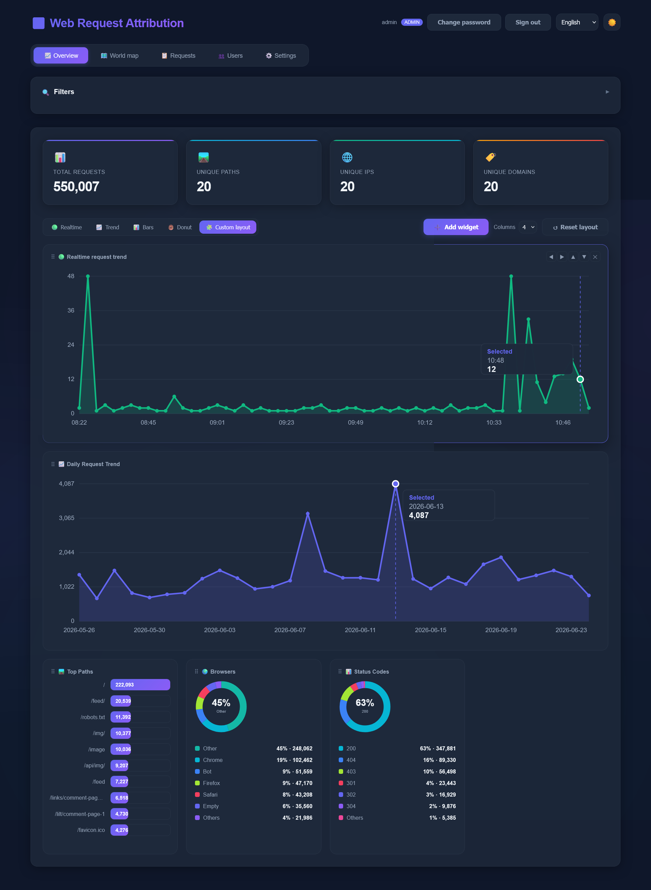
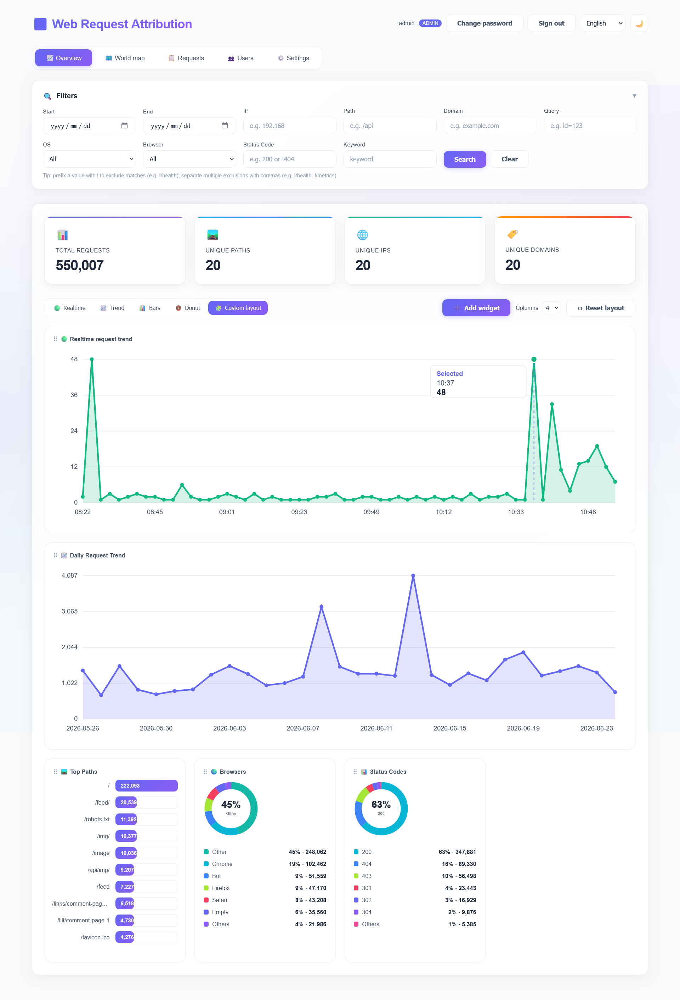

# Web Request Attribution

🌐 [English](README.md) | [繁體中文](README.zh-TW.md) | **简体中文** | [日本語](README.ja.md)

看看是谁在访问你的网站——数据完全留在自己手上，不经过任何第三方。

Web Request Attribution 会读取你的 Web 服务器（Nginx / Apache）访问日志，
变成一目了然的仪表板：访问趋势、热门页面、浏览器、状态码、请求来源世界
地图等等。它只是一个小小的程序，所有功能都内置——不需要数据库服务器、
不需要另外搭前端，也不用再安装任何东西。

## 截图预览

| 深色模式 | 浅色模式 |
|:-:|:-:|
|  |  |

## 特色

- 🚀 **单一文件、零依赖** — 下载一个程序就能直接运行
- 📊 **内置仪表板** — 打开浏览器，统计报表就在眼前
- 🗺️ **世界地图** — 看请求来自哪些国家/地区（免费、无需 API 密钥）；鼠标悬停气泡即可查看详情
- 📡 **实时更新** — 新的日志内容自动出现在仪表板上
- 🔍 **强大筛选** — 按 IP、页面、域名、浏览器、操作系统、状态码、关键词、日期深入分析；条件前加 `!` 即可排除（支持多个排除条件）
- 🔐 **可选登录** — 自己电脑上可开放使用，放上服务器可强制账号登录
- 🌐 **4 种语言** — 简体中文、繁體中文、English、日本語
- 🐳 **支持 Docker** — 一行命令完成部署

## 三步开始使用

**1. 下载**：从[最新 Release](https://github.com/moehoshio/WebRequestAttribution/releases/latest) 下载适合你系统的文件：

| 你的系统 | 下载文件 |
|---|---|
| Linux（x86_64） | `web-req-attr-linux-amd64` |
| Linux（ARM，如树莓派） | `web-req-attr-linux-arm64` |
| macOS（Intel） | `web-req-attr-darwin-amd64` |
| macOS（Apple Silicon） | `web-req-attr-darwin-arm64` |
| Windows | `web-req-attr-windows-amd64.exe` |

**2. 运行**（Linux/macOS；Windows 直接双击 `.exe` 即可）：

```bash
chmod +x web-req-attr-linux-amd64
./web-req-attr-linux-amd64
```

**3. 打开浏览器**访问 <http://localhost:8080>。完成！🎉

第一次运行时程序会自动创建 `config.json`。之后要监控哪些日志文件、追踪
哪些关键词，都可以直接在浏览器的「**设置**」标签页里完成。

## 指向你的日志文件

要分析网站流量，只需要告诉它访问日志在哪里。可以在浏览器的「**设置**」
标签页添加日志来源，或编辑 `config.json`：

```json
{
  "listen_addr": ":8080",
  "db_path": "./data/stats.db",
  "watch": true,
  "sources": [
    {
      "name": "my-website",
      "type": "file",
      "path": "/var/log/nginx/access.log",
      "format": { "engine": "nginx", "preset": "combined" }
    }
  ]
}
```

通俗解释：

- `listen_addr` — 仪表板使用的端口（`:8080` → http://localhost:8080）
- `db_path` — 统计数据的存放位置（就是一个文件）
- `watch` — 持续读取新增的日志内容
- `sources` — 要读取的日志文件。上面是 Nginx 的标准配置；Apache 请改用
  `"engine": "apache"`。

编辑后重启程序，流量就会出现在仪表板上。带注释的完整示例请见
[`config.example.json`](config.example.json)，所有选项的说明请见
[配置参考文档](docs/CONFIGURATION.md)（英文）。

### 导入既有的旧日志

监控模式只会读取*新增*的内容。想载入既有的历史日志，运行一次：

```bash
./web-req-attr-linux-amd64 -import /var/log/nginx/access.log
```

## 启用登录

默认情况下（尚未创建任何账号时），任何打得开页面的人都能使用仪表板——
在自己电脑上没问题，但放上公开服务器**不行**。要强制登录，请在首次
启动前于 `config.json` 加入：

```json
"auth": {
  "require_account": true
}
```

如果没有设置密码，程序会为 `admin` 用户生成一组随机密码并输出在启动
信息中——用它登录后，再到「**用户**」标签页修改密码。更多细节请见
[配置参考文档](docs/CONFIGURATION.md#authentication-auth)。

## 部署为常驻服务

想在服务器上长期运行，**[部署教程](docs/DEPLOYMENT.md)**（英文）提供
每种方式的逐步说明。Docker 的快速版本：

```bash
git clone https://github.com/moehoshio/WebRequestAttribution.git
cd WebRequestAttribution
cp config.example.json config.json   # 修改成指向你的日志
docker-compose up -d
```

教程中也涵盖不使用 Docker 的方式（systemd）、用 HTTPS 反向代理保护
仪表板，以及如何安全地更新。

## 常见问题

**我的数据会外流吗？**
不会。所有数据都存放在本机的单一 SQLite 文件。唯一可选的对外查询是
世界地图用的 IP → 国家解析（可在「设置」中关闭）。

**我的日志格式比较特殊，能解析吗？**
可以。除了标准的 Nginx/Apache 格式外，也能用自定义 pattern 描述任意格式。
请见[配置参考文档](docs/CONFIGURATION.md#custom-formats)。

**世界地图显示「暂无地理位置数据」。**
位置是后台逐步解析的——第一次导入后等几分钟再看看。

## 文档

| 文档 | 内容 |
|---|---|
| [部署教程](docs/DEPLOYMENT.md) | Docker、systemd、HTTPS、更新、疑难解答 |
| [配置参考](docs/CONFIGURATION.md) | `config.json` 所有选项的完整说明 |
| [开发者指南](docs/DEVELOPMENT.md) | 从源码编译、HTTP API、项目内部结构 |
| [贡献指南](CONTRIBUTING.md) | 如何贡献代码 |

## 许可证

MIT License
